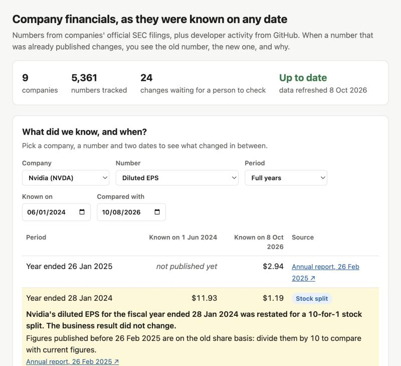
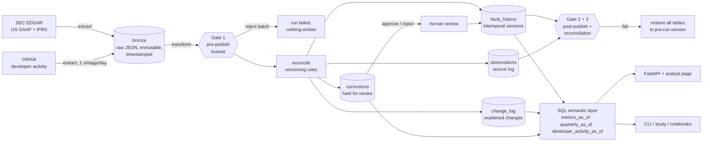

# pitlake: point-in-time fundamentals and alternative data, with every change explained

> *"A number in my report changed overnight for a date that was already closed. How?"*

pitlake is a small data product that answers that question. It ingests company financials
from SEC filings and developer activity from GitHub into a Delta Lake, keeps **every version
of every number** with the date it became known, and explains each change in plain English.
Anything that looks wrong, such as a change with no filing behind it or a filing that
mislabels its own periods, is held back for a person to review.

It runs on real data for the **largest holdings of BIT Global Technology Leaders** (BIT
Capital's public factsheet as of 30 Sep 2026): Amazon, IREN, Nvidia, Micron, TSMC, Meta,
Microsoft, Hinge Health and Silicon Motion. That covers US GAAP and IFRS filers, including
TSMC in Taiwan dollars. With no manual input, the sample shows:

* **240 changes to published numbers**, explained: 198 revisions by companies and 42
  stock-split adjustments (Nvidia 4:1 and 10:1, Amazon 20:1).
* **24 values held for review**: the machine-readable (XBRL) data filed with Amazon's 10-K
  of 30 Jan 2013 tagged its 2011 and 2012 quarterly figures to the wrong years. The report's
  own table is correct, but the data that models ingest was not. A "latest value" dataset
  would have published it, and still shows a wrong Q4 2011 revenue figure today.
* **2 freshness warnings**: TSMC and Silicon Motion have not filed machine-readable
  financials for months, a coverage gap a person should know about.



## Why point-in-time matters

Companies restate history. After Nvidia's 10-for-1 split, the 10-K filed on 26 Feb 2025
restated fiscal 2023 diluted EPS from **$1.74** to **$0.17**. A dataset that keeps only "the
latest value" causes two problems:

1. **Analysts** see numbers in closed reports move without warning.
2. **Backtests** quietly use information that did not exist yet (look-ahead bias). Worse,
   Nvidia's fiscal 2022 EPS ($3.85) was never restated for the 10:1 split, so today's data
   shows EPS falling **96%** in fiscal 2023. As reported at the time, it fell **55%**.

```console
$ pitlake asof NVDA eps_diluted --period-type annual --as-of 2024-06-01   # FY2023 -> 1.74
$ pitlake asof NVDA eps_diluted --period-type annual --as-of 2025-03-01   # FY2023 -> 0.17
$ pitlake history NVDA eps_diluted 2023-01-29          # JSON output, abbreviated:
   1.74  known 2023-02-24 → 2025-02-26  initial      10-K
   0.17  known 2025-02-26 → (current)   restatement  10-K
```

## Research example: does point-in-time data change the answer?

[`docs/research/point-in-time-vs-latest.md`](docs/research/point-in-time-vs-latest.md) is
generated by `pitlake study`. For every company and period it computes growth twice, as
reported at the time and from today's data, and shows where they disagree and why:

* **Mixed share bases after splits** produce collapses that never happened (Nvidia FY2023,
  Amazon 2020).
* **Accounting changes** rewrite history: Microsoft's fiscal 2017 quarters grew faster after
  it restated them for the new revenue standard than they did as first reported.
* **Errors in the source**: the Amazon filing above.
* **Alternative-data backfill**: a year of GitHub history arrives on the first day of
  collection, and none of it may be used for earlier dates.

## Alternative data: developer activity

BIT Capital names developer activity among the alternative data it uses. pitlake collects
weekly commit activity on each company's flagship open-source projects (Nvidia's CUDA
libraries, Meta's PyTorch, Microsoft's VS Code and TypeScript, Amazon's AWS CDK; see
[`conf/altdata.toml`](src/pitlake/conf/altdata.toml)) and treats it with the same rules as
filings:

* **Known from the day it was collected.** The first collection returns a year of history;
  every week is marked as known only from that day, so a backtest can never use history it
  would not have had. This is the "vendor backfill" problem of alternative data.
* **One vintage per day.** Each daily collection is a new version; a changed count for a
  past week is recorded and explained ("revised by the source").
* **Its own data-quality checks:** whole weeks only, non-negative counts, collected within
  the last 3 days (warning).

## Quickstart

```bash
make setup     # virtualenv + dependencies (Python 3.11+)
make demo      # builds the lake from the committed sample, prints a few answers
make serve     # analyst page at http://127.0.0.1:8000, OpenAPI docs at /docs
make test      # unit, property-based, data-quality, integration and API tests
.venv/bin/pitlake study   # the research example above
```

Or the whole thing in containers, as it would run in production:

```bash
docker compose up --build      # one-shot ingest job, then the API on http://localhost:8000
```

Live data (the SEC asks for a contact in the User-Agent; GitHub allows 60 requests an hour
without a token):

```bash
export SEC_USER_AGENT="Your Name you@example.com"
.venv/bin/pitlake ingest --source sec
.venv/bin/pitlake ingest --source github     # set GITHUB_TOKEN for higher limits
```

### Airflow

The DAG in [`dags/pitlake_daily.py`](dags/pitlake_daily.py) ingests the holdings in three
groups, then collects developer activity, then alerts people. It is tested in real Airflow 3,
which lives in its own environment because of its pinned dependencies:

```bash
make airflow-setup   # Python 3.12 venv with Airflow 3.3.2 + official constraints
make airflow-test    # DAG structure + a full `airflow dags test` run on the sample
```

## What it does, and what it does not

| It does | It does not (yet) |
|---|---|
| Keep every value with `known_from` / `known_to` so any query can run "as of" a date | Handle prices or a corporate actions feed. Splits are *inferred* from restated per-share values |
| Read US GAAP and IFRS filers, each in its reporting currency (convenience translations dropped) | Convert currencies. TSMC stays in TWD |
| Detect restatements, stock splits (incl. reverse splits) and periods swapped in the filer's XBRL data | Normalise the whole history to one share basis |
| Hold back changes that need judgement, for human approval or rejection | Cover non-SEC companies in the fund (e.g. Infineon) |
| Collect alternative data with collection-date point-in-time semantics | Offer more alternative data than GitHub developer activity |
| Gate every run with declarative data-quality checks, rolling back on failure | Run distributed. One machine handles this data size easily |

## Architecture



* **Storage:** Delta Lake tables (the Databricks table format), written with `delta-rs`
  so everything runs locally with no cluster.
* **SQL:** DuckDB as the local SQL engine over those tables. The semantic layer is plain SQL
  in [`src/pitlake/sql/views.sql`](src/pitlake/sql/views.sql).
* **Orchestration:** plain Python functions. The Airflow DAG, the CLI, Docker and the tests
  all call the same ones.
* **Data quality:** [trueset](https://pypi.org/project/trueset/) suites in
  [`src/pitlake/conf/dq/`](src/pitlake/conf/dq/), run on DuckDB.

## The versioning rules

The rule of thumb: **a published value only changes automatically when a newer, dated
document says so, and the change looks plausible.** Everything else waits for review. See
[`reconcile.py`](src/pitlake/reconcile.py); every row below has a unit test.

| Situation | Action |
|---|---|
| Fact never seen | Publish the first version |
| Same document seen again, same value | Nothing (re-runs are idempotent) |
| Same document seen again, **different value** | **Hold for review**: a filing never changes, so the source or our parsing changed silently |
| Later document, same value | Confirmation: recorded, no new version |
| Later document, different value | **Restatement**: close the old version at the filing date, publish the new one, write an explanation |
| Filing **swaps two periods' values** (a year apart) | **Hold for review** (`suspected_wrong_period`): a tagging error, not a restatement. Real case: the XBRL data of Amazon's 10-K, 30 Jan 2013 |
| Older document than the current version, different value | Hold for review (`late_arrival`) |
| Two documents on the same day disagree | Hold for review (`same_day_conflict`) |

An approved correction becomes a new version effective from the review date, with the
reviewer and reason in the change log. **Old values are never overwritten**, so earlier
as-of queries keep returning what was known at the time.

### Three time axes

| Column | Meaning | Used for |
|---|---|---|
| `period_start` / `period_end` | the business period (e.g. FY2023, or a week) | what the number is about |
| `known_from` / `known_to` | when the value became known (SEC filing date, or GitHub collection date) | as-of queries, backtests |
| `recorded_at` | when our pipeline wrote it | audit trail, debugging |

## Data quality: three gates with trueset

Checks are declared in YAML, so a reviewer can read the data contract without reading
Python. They run with [trueset](https://pypi.org/project/trueset/) on DuckDB, and every
result goes into the `dq_results` table for every run.

| Gate | When | Examples | On failure |
|---|---|---|---|
| [`pre_publish`](src/pitlake/conf/dq/pre_publish.yml) | before any write | per source: SEC accession format, unit fits the metric (USD, TWD, per share...), nothing known before its period ends; GitHub: whole weeks, no negative counts | batch rejected, nothing written |
| [`post_publish`](src/pitlake/conf/dq/post_publish.yml) | after the write | exactly one current version per fact, no overlapping or empty intervals, every change explained; *warn* if a company has not filed for 120 days or GitHub was not collected for 3 | **every table restored** to its pre-run Delta version |
| [`reconciliation`](src/pitlake/conf/dq/reconciliation.yml) | after the write | trueset `value_parity`: published current value == latest accepted source value, for every fact | rollback, as above |

Gates 2 and 3 test the *pipeline's own logic*, not just the input. The integration tests
inject two bugs (a duplicate open version, a wrong published value) and assert that the
gates catch each one and the writes are rolled back.

## Design decisions and trade-offs

* **"Known from" = when the information existed.** For filings that is the SEC `filed`
  date; for alternative data it is the day we collected it, never the week it describes.
* **Documented restatements apply automatically; suspicious changes do not.** A restatement
  in a filing is the company's official statement, so it is applied, flagged and explained.
  Holding all ~240 for review would bury reviewers. Changes with no new document, or that
  look like a filer's tagging error, need a human.
* **Tagging errors are detected conservatively.** A filing is flagged only if it swaps
  values between periods a year apart, or moves a *distinctive* number (at least 4
  significant figures) to the other period. Round numbers like 460,000,000 shares can
  match by coincidence and are not treated as evidence.
* **Reporting currency only.** Foreign filers add USD "convenience translations" at a single
  exchange rate; those are not the company's figures and are dropped.
* **Delta + DuckDB, not Postgres.** The target platform is a lakehouse (Databricks), so the
  tables are Delta and the SQL stays close to Databricks SQL. DuckDB is a zero-setup local
  engine, so anyone can run the project in one command.
* **Atomic history writes.** Closing old versions and inserting new ones is a single Delta
  `MERGE`, so readers never see a half-applied restatement.
* **Q4 is derived, never stored.** Companies rarely file a standalone Q4. Deriving it at query
  time (FY − Q1..Q3) means a restated quarter automatically corrects Q4. It is only done for
  additive metrics: Q4 EPS ≠ FY EPS − Q1..Q3 EPS.

Recorded as decision records in [`docs/adr/`](docs/adr/).

## Running in production (AWS + Databricks)

[`docs/production.md`](docs/production.md) covers the daily flow, who uses what, Airflow vs
Databricks Workflows, delivery, security and monitoring. In short:

* The same wheel and entry point run everywhere: CLI, Airflow DAG, Docker image, and a
  Databricks job defined as a bundle in [`databricks.yml`](databricks.yml).
* Delta tables on S3, registered in Unity Catalog. The as-of macros become Unity Catalog SQL
  functions. trueset runs the same YAML checks through its SQLAlchemy backend.
* CD: every merge to `main` builds the image and wheel and deploys to staging; a version tag
  deploys the same artifacts to production after a required reviewer approves.

What has and has not been run: the CLI, the Airflow DAG (real Airflow 3.3.2) and the Docker
stack have been run end to end. The Databricks bundle and the release workflow have **not**
been run against a real workspace or registry yet.

## Project layout

```
dags/              Airflow DAG (tested in real Airflow 3)
data/sample/       real SEC filings for the holdings + one real GitHub snapshot (184 KB)
docs/              production design, decision records (adr/), research example (research/)
scripts/           refresh the sample from live sources
src/pitlake/
  conf/            universe (with factsheet source), metric map (US GAAP + IFRS),
                   alternative data repos, trueset data-quality suites (dq/)
  extract.py       SEC client (rate-limited, retries) -> immutable bronze files
  github.py        GitHub developer activity -> bronze, one vintage per day
  transform.py     SEC JSON -> typed observations, reporting currency only
  reconcile.py     the versioning rules (pure functions)
  explain.py       plain-English explanations (headline / what it means), split detection
  quality.py       trueset gates
  lake.py          Delta tables, atomic MERGE, rollback
  pipeline.py      run(): extract -> gate -> reconcile -> publish -> audit
  corrections.py   human review: approve / reject
  research.py      `pitlake study`: point-in-time vs latest
  notify.py        Slack alerts (or log) for failures, revisions, review queue
  sql/views.sql    as-of semantic layer (SQL)
  api.py, web/     FastAPI + analyst page
tests/             unit, property-based, data-quality, integration, API, DAG, live contract
databricks.yml     Databricks Asset Bundle (production job)
Dockerfile, docker-compose.yml
.github/           CI, release (CD), nightly checks, Dependabot, PR + data-request templates
CLAUDE.md          conventions for AI coding agents working in this repo
```

## Built with Claude Code

I built this with Claude Code as a pair programmer, and the AI-assisted work went through
the same gates as any other change: tests, lint, data-quality gates, CI and checking results
against the source filings. [`CLAUDE.md`](CLAUDE.md) holds the rules agents follow in this
repo. Things the loop caught along the way:

* **A tagging error in the data filed with Amazon's 10-K**, which first looked like a
  pipeline bug: revenue
  "restated" from $9.86bn to $13.19bn and back. The first fix flagged too much (round share
  counts matching by coincidence), so it was narrowed to the swap pattern and distinctive
  numbers, with tests for both. Reading the 10-K itself then showed its own table is correct: only
  the machine-readable tags were wrong, so the wording everywhere now says so.
* **A wrong split label:** Nvidia's EPS going from $1.74 to $0.17 was labelled a "90%
  revision". EPS is filed in cents ($0.174 became $0.17), so split detection now allows for
  cent rounding above $0.10, where it can still tell the difference.
* **An idea the data disproved:** I planned to rebuild past versions of GitHub activity from
  commit dates, but squash merges give commits their merge date, so there was nothing to
  rebuild. The design changed to collection-date point-in-time instead.
* **Ownership changes:** React moved from Meta to an independent foundation, so it was
  dropped rather than counted as Meta's activity.
* The first end-to-end run failed the post-publish gate (a `string_view` type mismatch
  between delta-rs and DuckDB); the rollback restored every table.
* Checking the page in a real browser found UI bugs the API tests could not (an empty
  dropdown, cramped explanations, "$-0.60").
* Building the Docker image showed the config was not inside the package, so an installed
  wheel (as on Databricks) would not have found it.
* Running the DAG in real Airflow 3.3 caught API changes a mocked test would have missed.

## Testing

| Layer | What it proves |
|---|---|
| [`test_reconcile.py`](tests/test_reconcile.py) | every versioning rule, including swapped periods and alternative-data revisions |
| [`test_properties.py`](tests/test_properties.py) | Hypothesis generates ~1,600 random filing histories: always one current version, no gaps or overlaps, order-independent, incremental runs == one big run, re-runs change nothing |
| [`test_explain_transform.py`](tests/test_explain_transform.py) | the exact wording analysts see, split direction, currencies, IFRS parsing |
| [`test_quality.py`](tests/test_quality.py) | each data-quality check fails on a crafted bad batch, per source |
| [`test_pipeline_integration.py`](tests/test_pipeline_integration.py) | real Delta tables + real sample: Nvidia's split history, TSMC in TWD, Amazon's tagging error held back, backfilled GitHub history invisible before collection, rollback on two injected bugs, review flow |
| [`test_research.py`](tests/test_research.py) | the study finds Nvidia's -55% vs -96% |
| [`test_github.py`](tests/test_github.py), [`test_api.py`](tests/test_api.py), [`test_extract_cli.py`](tests/test_extract_cli.py), [`test_notify.py`](tests/test_notify.py) | GitHub client (mocked), API contract, mocked SEC client, CLI, alerting |
| [`test_dag.py`](tests/test_dag.py) | DAG structure and a full `airflow dags test` run in real Airflow |
| [`test_live_sec.py`](tests/test_live_sec.py), [`test_live_github.py`](tests/test_live_github.py) | nightly contract tests against the real APIs |

[CI](.github/workflows/ci.yml) runs lint, tests on Python 3.11–3.13 with a coverage floor, the
Airflow job, a dependency audit, a Docker build-and-run check, and a pipeline smoke job that
ingests the sample twice and fails if any gate failed or the second run was not a no-op.

## Data

* Financial data: SEC EDGAR's public XBRL API (U.S. government data).
* Developer activity: GitHub's public REST API (commit activity statistics).
* Holdings: BIT Capital's public factsheet for BIT Global Technology Leaders (R-I),
  as of 30 Sep 2026. Used only to choose which companies to track.

The sample in `data/sample/` is a snapshot taken on 8 Oct 2026. This project illustrates a
data problem; it is not investment research or advice.
