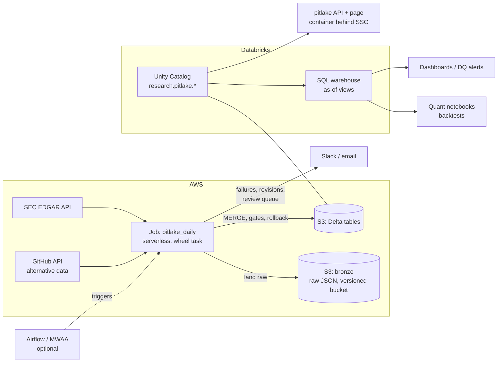

# Running pitlake in production (AWS + Databricks)

This is how I would run pitlake on a Python / SQL / AWS / Databricks stack. Everything in the
repo is built to drop into it: one wheel, one entry point, Delta tables, declarative checks.
The Databricks deployment (`databricks.yml`) has **not been run against a real workspace yet**;
the rest has been run end to end locally (CLI, Airflow, Docker).

## The daily flow



1. **06:00 UTC on weekdays** the `pitlake_daily` job runs (a Databricks Workflow defined in
   `databricks.yml`; the schedule matches the Airflow DAG).
2. It fetches SEC filings (US GAAP and IFRS) and GitHub developer activity and lands the raw
   JSON in an S3 bronze bucket (versioning on, so any published number can be traced to the
   exact bytes received). Alternative data is collected every day: the history collected
   ourselves is the only history a backtest can trust.
3. Gate 1 (trueset) validates the batch. A bad batch stops here and nothing is written.
4. The versioning rules publish new and restated values to Delta tables in a single `MERGE`.
5. Gates 2 and 3 check the written history and reconcile it against the source. On failure,
   every table is restored to its pre-run Delta version.
6. People are told about what needs them: failed runs, restatements, changes awaiting review,
   stale companies.

The run takes a few minutes on a single serverless task, so the cost is a few minutes of
compute per day.

## Who uses it, and how

| User | How they reach the data |
|---|---|
| Analysts | The pitlake page (plain-English changes, links to filings), or a dashboard on the change log |
| Quantitative Research | Databricks SQL / notebooks using the as-of views: a backtest on day D only sees data filed by D |
| AI Engineering | The REST API (`/api/...`, OpenAPI at `/docs`), e.g. as a tool for an LLM agent that must cite sources |
| Data team | `pitlake corrections list/approve/reject`, `dq_results`, `pipeline_runs` |

## Mapping the local pieces to the platform

| Local (this repo) | Production |
|---|---|
| `data/bronze/` | S3 bucket, versioned, lifecycle to cheaper storage after 90 days |
| `data/lake/` Delta tables (delta-rs) | Delta tables on S3 registered in Unity Catalog (`research.pitlake.*`) |
| DuckDB SQL macros (`sql/views.sql`) | Unity Catalog SQL table functions with the same SQL (`facts_as_of(date)` etc.) |
| `pitlake ingest` CLI | Databricks wheel task, same entry point (`databricks.yml`) |
| Airflow DAG | Either Databricks Workflows alone, or MWAA triggering the Databricks job (see below) |
| trueset on DuckDB | trueset's SQLAlchemy backend on a Databricks SQL warehouse, same YAML checks |
| Docker image (`pitlake serve`) | ECS Fargate or Databricks Apps, behind company SSO, read-only |
| `PITLAKE_SLACK_WEBHOOK` | Webhook URL stored in a Databricks secret scope / AWS Secrets Manager |

### Airflow or Databricks Workflows?

Both run the same `pitlake.pipeline.run`. Which one depends on what the team already operates:

* **Already on Airflow (MWAA):** keep the DAG as the single place to see all pipelines, and
  make each `ingest_*` task trigger the Databricks job (`DatabricksRunNowOperator`) instead
  of running in the Airflow worker. Airflow orchestrates; Databricks computes.
* **Databricks-only:** use the Workflow in `databricks.yml` and drop Airflow. One fewer
  system to run.

I would not run heavy data work inside Airflow workers in production. The local DAG does so
only to stay self-contained.

## Delivery: from pull request to production

```
PR ──► CI: lint · tests (3.11–3.13) · property tests · Airflow DAG test · Docker build+run
       · dependency audit · pipeline smoke (ingest twice, all gates pass, idempotent)
merge to main ──► Release: image → registry, wheel, `databricks bundle deploy -t staging`
tag v1.2.3 ──► same artifacts → production, after a required reviewer approves
nightly ──► live SEC contract test · new-CVE audit
```

* **The same artifact everywhere.** The wheel and image built once are what staging and
  production run.
* **Backfills replay bronze.** `pipeline.run(paths=[...])` re-processes stored raw files. Because
  runs are idempotent, a backfill can be repeated safely.
* **Schema changes are additive.** New columns use Delta schema evolution. Existing columns
  are never repurposed, because people's queries depend on them.

## Security

* **Least privilege.** The job's service principal can write `research.pitlake.*`. Analysts
  and the API get read-only Unity Catalog grants. Approving a correction is a separate
  permission, and the reviewer's SSO identity is recorded in the audit trail.
* **No secrets in code.** The SEC contact, Slack webhook and Databricks token come from
  secret scopes or CI secrets. CI never calls the SEC; the nightly job uses a configured contact.
* **Input is untrusted.** All SQL parameters are bound. The page escapes every value it
  renders. The container runs as a non-root user with one writable path.
* **Dependencies** are pinned in CI, audited on every PR and nightly, and updated weekly by
  Dependabot.

## Observability

* `pipeline_runs`: one row per run with counts, status, warnings. A Databricks SQL alert fires
  if today's run is missing or failed.
* `dq_results`: every check result of every run, so you can see when a check started failing.
* Freshness: a warning if any company has not filed for 120 days (usually a ticker change or
  a broken extract).
* The job's own failure email/Slack, plus the summary sent by the report step.

## What I would confirm with the team first

1. Airflow (MWAA) in use, or Databricks Workflows only?
2. Unity Catalog layout and naming (catalog/schema per domain? per environment?).
3. Which vendor feeds (Bloomberg, FactSet, the alternative data already licensed) should come
   next. The bronze → gates → versioning pattern is source-agnostic (GitHub already uses it),
   but each source needs its own "what counts as a documented correction" rule and its own
   answer to "is vendor history backfilled?".
4. Who reviews quarantined changes, and how quickly they need to be told.
